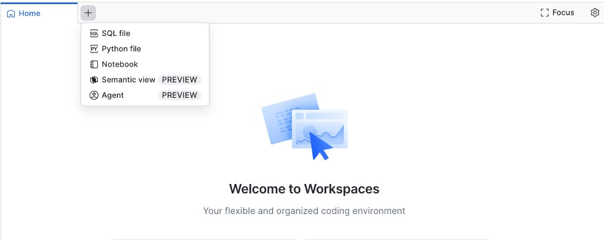
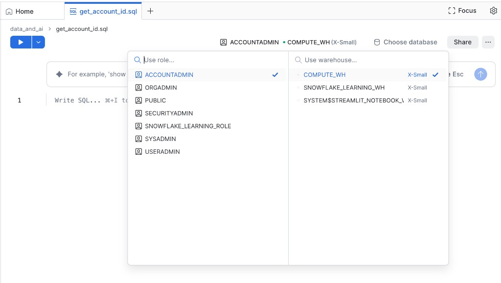
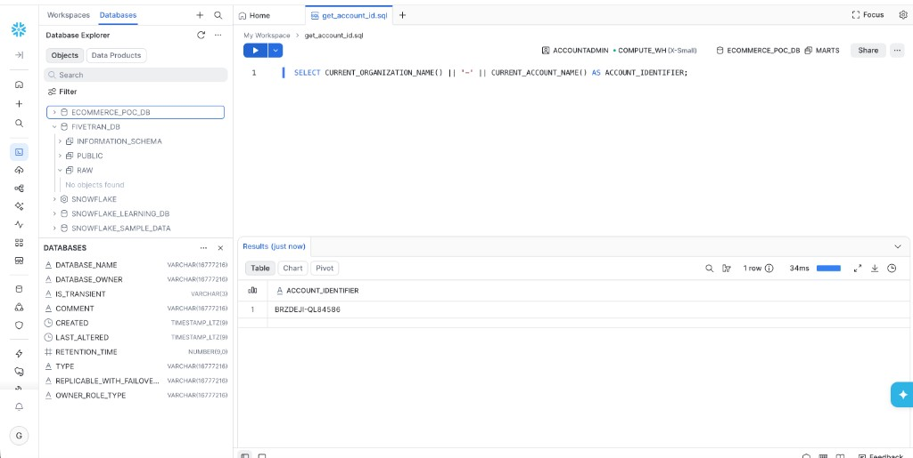
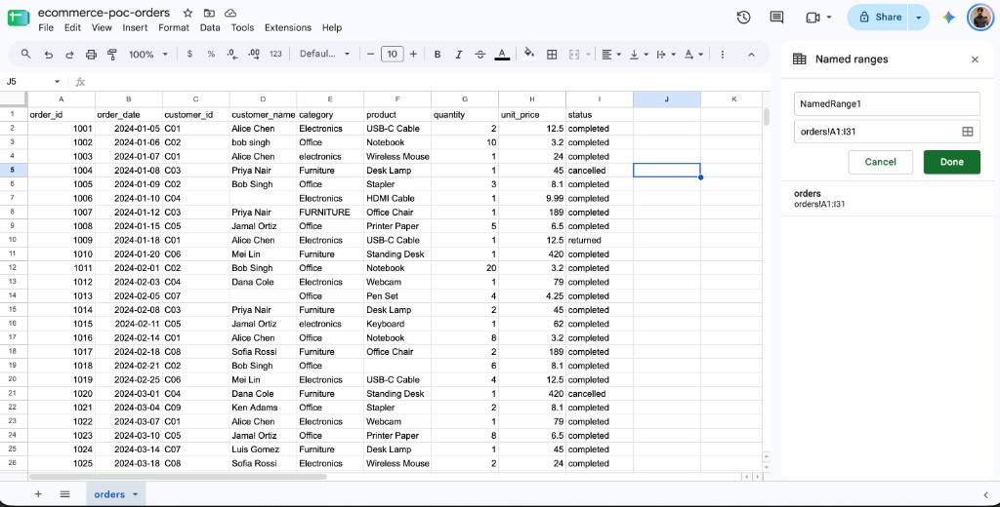
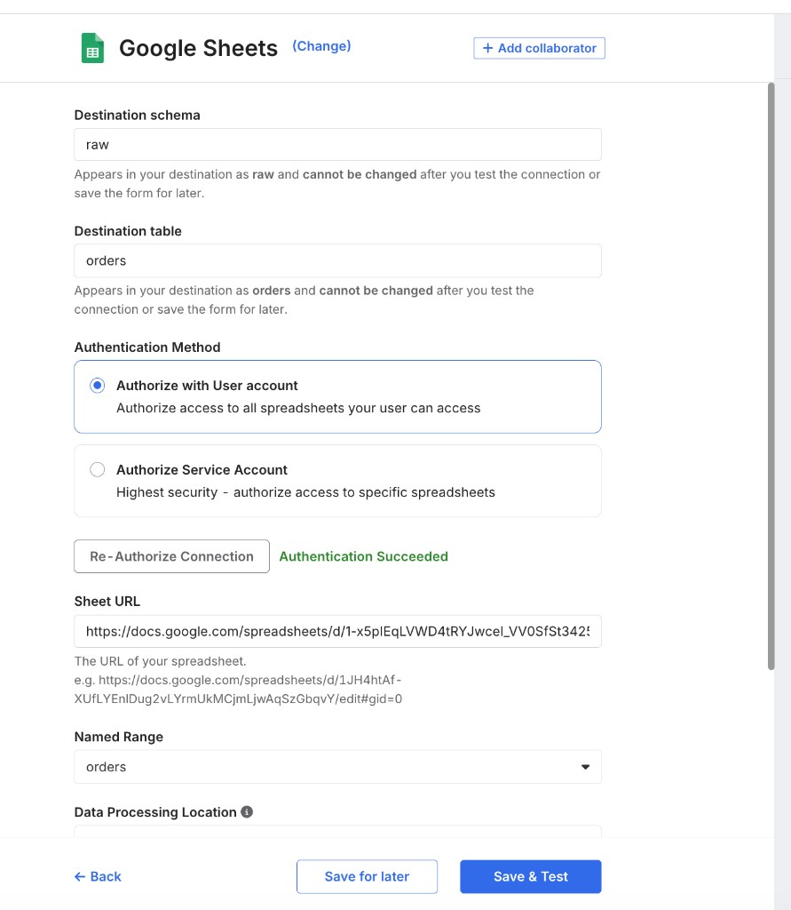
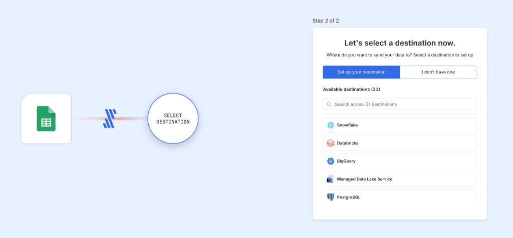
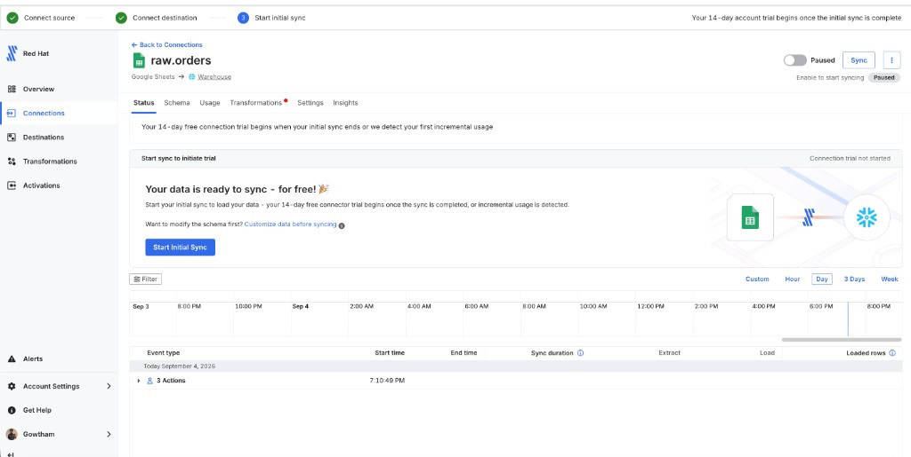
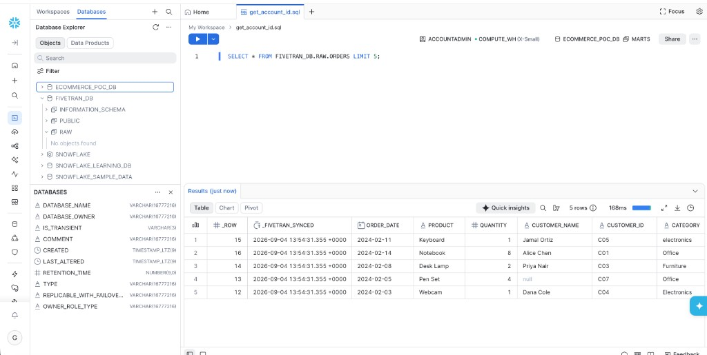
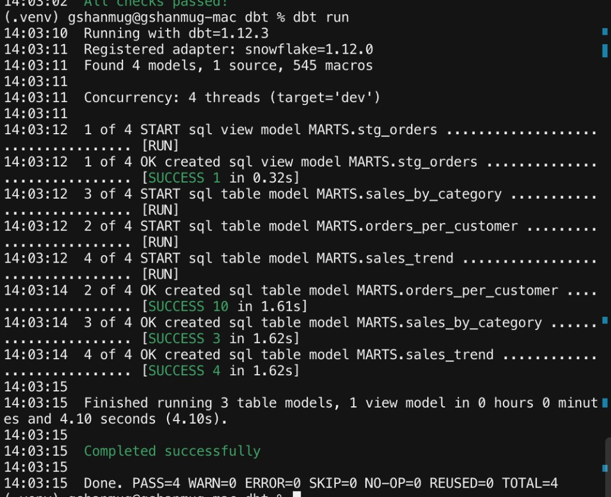
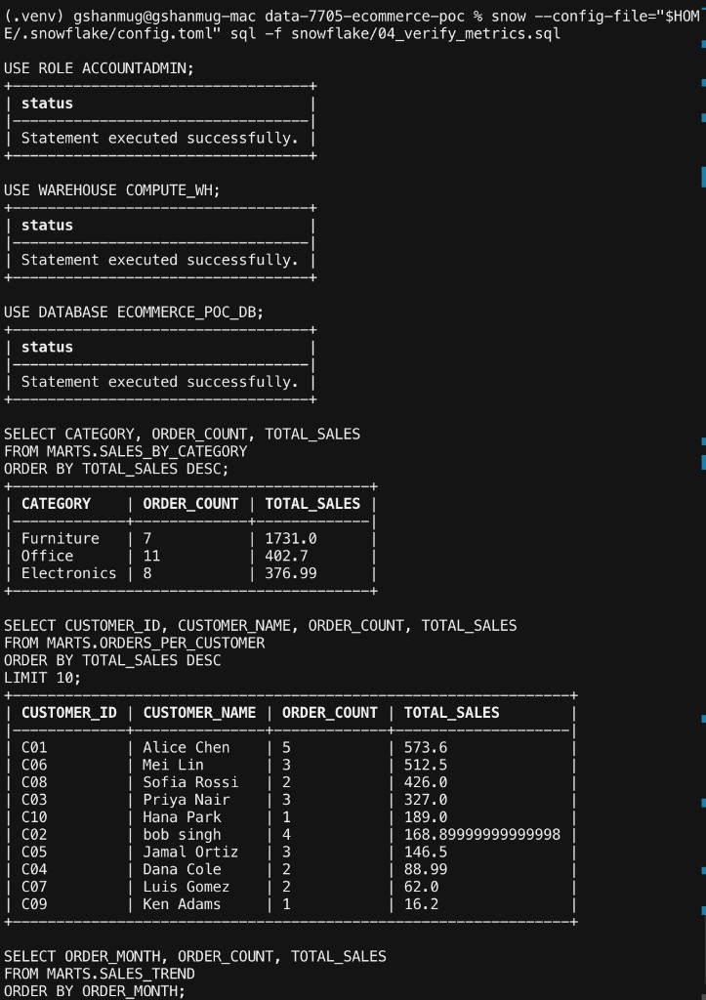

# DDIS onboarding lab

Build a small copy of the Dataverse path: **Google Sheets → Fivetran → Snowflake → dbt**. Ticket: [DATA-7705](https://redhat.atlassian.net/browse/DATA-7705).

You finish when you can query three sales tables in Snowflake. Time: about **2 hours**. Cost: **free trials**. Lab, not production. Use your own accounts.

**Do not copy** `GOWTHAM` or `BRZDEJI-QL84586` from screenshots. Use yours.

```text
Google Sheets  →  Fivetran  →  FIVETRAN_DB.RAW  →  dbt  →  ECOMMERCE_POC_DB.MARTS  →  SELECT
```

Sheets is the source. Fivetran copies it into Snowflake. dbt writes clean tables in `MARTS`. You query `MARTS`.

After the lab, read [How this lab maps to Dataverse](./docs/lab-vs-platform-tooling.md). That page shows which Git repos and OpenShift operators replace the clicks in this README.

Written for **macOS** with Homebrew. Run SQL in the Snowflake website (**Projects → Workspaces**).

## What you need

- A Mac, Python 3, Homebrew
- Two values you will paste in the CLI, Fivetran Host, and dbt:

| Value | Where you get it | Example (do not copy) |
|---|---|---|
| Account id | Step 1 SQL | `BRZDEJI-QL84586` |
| Username | Snowflake welcome email | `GOWTHAM` |

## Steps

1. [Create accounts and clone the repo](#1-create-accounts-and-clone-the-repo)
2. [Create the databases and schemas](#2-create-the-databases-and-schemas)
3. [Connect the Snowflake CLI](#3-connect-the-snowflake-cli)
4. [Load sample orders into Google Sheets](#4-load-sample-orders-into-google-sheets)
5. [Fivetran source: Google Sheets](#5-fivetran-source-google-sheets)
6. [Fivetran destination: Snowflake](#6-fivetran-destination-snowflake)
7. [Run dbt](#7-run-dbt)
8. [Query the metrics](#8-query-the-metrics)

---

### 1. Create accounts and clone the repo

**Where:** Browser, then Mac / Terminal, then Snowflake / Workspaces.

1. **Browser:** Sign up at [Snowflake](https://signup.snowflake.com), [Fivetran](https://fivetran.com/signup), and Google Sheets.
2. After signup, Snowflake sends this email. Copy **Username** (`user` in the CLI) and the host before `.snowflakecomputing.com` (`account`).


3. **Mac / Terminal:** Install the CLI and clone this repo.

```bash
brew install snowflake-cli
git clone https://github.com/GowthamShanmugam/ddis-onboarding-lab.git
cd ddis-onboarding-lab
```

4. **Leave Terminal.** Open [https://app.snowflake.com](https://app.snowflake.com) and sign in. You will paste this account id in the CLI (step 3), Fivetran Host (step 6), and dbt (step 7).
5. Left menu: **Projects → Workspaces**. Stay in the default **My Workspace**.
6. Click `+` (top left) → **SQL file**. Name it `get_account_id.sql`.



7. Click the role and warehouse names at the top of the editor (see picture). Set role `ACCOUNTADMIN` and warehouse `COMPUTE_WH`.



8. Paste, then click Run (`Cmd+Enter`):

```sql
SELECT CURRENT_ORGANIZATION_NAME() || '-' || CURRENT_ACCOUNT_NAME() AS ACCOUNT_IDENTIFIER;
```



9. Copy **your** result. It will not match the screenshot. Keep it in a local note. Add `.snowflakecomputing.com` only in the Fivetran Host field in step 6.

---

### 2. Create the databases and schemas

**Where:** Snowflake / Workspaces. Same SQL file as step 1.

Creates `FIVETRAN_DB.RAW` (landing) and `ECOMMERCE_POC_DB.MARTS` (dbt output). If `COMPUTE_WH` is missing, run `SHOW WAREHOUSES` and use a warehouse that exists.

1. Paste, then Run:

```sql
USE ROLE ACCOUNTADMIN;
USE WAREHOUSE COMPUTE_WH;

CREATE DATABASE IF NOT EXISTS FIVETRAN_DB;
CREATE SCHEMA IF NOT EXISTS FIVETRAN_DB.RAW;

CREATE DATABASE IF NOT EXISTS ECOMMERCE_POC_DB;
CREATE SCHEMA IF NOT EXISTS ECOMMERCE_POC_DB.MARTS;
```

---

### 3. Connect the Snowflake CLI

**Where:** Mac / Terminal. Not Workspaces.

This file tells the `snow` command which account to use. Password stays in the environment, not in the file.

1. Open **Terminal** (Spotlight, then type `Terminal`).
2. Create the config folder and file:

```bash
mkdir -p ~/.snowflake
nano ~/.snowflake/config.toml
```

3. Paste this. Replace `<account_identifier>` and `<username>` with the values from step 1. Save (`Ctrl+O`, Enter) and exit (`Ctrl+X`).

```toml
default_connection_name = "poc"

[connections.poc]
account = "<account_identifier>"   # SQL result — not your login name
user = "<username>"                # Snowflake login from the welcome email
role = "ACCOUNTADMIN"
warehouse = "COMPUTE_WH"
database = "FIVETRAN_DB"
schema = "RAW"
```

4. Lock the file, set your Snowflake password in this Terminal, then test:

```bash
chmod 0600 ~/.snowflake/config.toml
export SNOWFLAKE_PASSWORD='<password>'
snow --config-file="$HOME/.snowflake/config.toml" connection test
```

Expect Status `OK`.

---

### 4. Load sample orders into Google Sheets

**Where:** Browser / Google Sheets. Have `data/orders.csv` from the cloned repo.

Fivetran reads a **named range**, not the tab name. Do not copy-paste the CSV. Sheets will put the whole row in one column.

1. Open [Google Sheets](https://sheets.google.com). New spreadsheet. Name it `ecommerce-poc-orders`. Rename the bottom tab to `orders`.
2. **File → Import → Upload**. Choose `data/orders.csv` from the cloned repo.
3. Import location: **Replace current sheet**. Separator: **Comma**. Click **Import data**. You should see headers in A1:I1 and rows down to row 31.
4. Select **A1:I31** (all imported cells, not only A1).
5. **Data → Named ranges**. Change **Name** from `NamedRange1` to `orders`. Set **Range** to `orders!A1:I31`. Click **Done**.



---

### 5. Fivetran source: Google Sheets

**Where:** Browser / Fivetran.

Skip Service Account. Use **User OAuth** (Authorize with User account). Do not copy schema, table, or Sheet URL from the screenshot.

1. In [fivetran.com](https://fivetran.com), after signup you should see **Step 1 of 2**. Click **Google Sheets**. If you are on the dashboard instead: **Connectors → Add connector → Google Sheets**.


2. **Destination schema** — type `raw` (replace `google_sheets`).
3. **Destination table** — type `orders`.
4. **Destination names** — leave **Fivetran naming** selected.
5. **Authentication Method** — Authorize with User account. Click **Authorize**. Sign in with Google. Allow access.
6. **Sheet URL** — paste the URL from the Google Sheets address bar.
7. **Named Range** — pick `orders`.
8. Leave **Data processing location** and **cloud provider** as they are.
9. Click **Save & Test**.



---

### 6. Fivetran destination: Snowflake

**Where:** Browser / Fivetran. Use Workspaces only if the warehouse test fails.

Use **your** Host and User. Do not copy them from the pictures.

1. **Step 2 of 2:** keep **Set up your destination**. Click **Snowflake**.



2. **Host** — `<account_identifier>.snowflakecomputing.com`
3. **Port** — `443`
4. **User** — `<username>`
5. **Database** — `FIVETRAN_DB`
6. **Auth** — PASSWORD. **Password** — your Snowflake password.
7. **Role** — `ACCOUNTADMIN`
8. **Table type** — Snowflake Native Tables
9. **Connection method** — Connect directly
10. **Storage for unstructured files** — INTERNAL
11. **Load Virtual Warehouses** — click, then Default Virtual Warehouse = `COMPUTE_WH`
12. Leave **Data processing location**, cloud, and region as Fivetran filled them.
13. Click **Save & Test**.


14. On the `raw.orders` Status page, click **Start Initial Sync**. Wait until it finishes. The connection is Paused until you click that button.



15. If the warehouse test failed, run this in Workspaces (your username):

```sql
ALTER USER <username> SET DEFAULT_WAREHOUSE = COMPUTE_WH;
```

16. Confirm rows landed (Workspaces):

```sql
SELECT COUNT(*) FROM FIVETRAN_DB.RAW.ORDERS;
SELECT * FROM FIVETRAN_DB.RAW.ORDERS LIMIT 5;
```



Count should be greater than 0. You should also see `_FIVETRAN_SYNCED`.

---

### 7. Run dbt

**Where:** Mac / Terminal. The repo folder you cloned in step 1. Not Workspaces.

Reads `FIVETRAN_DB.RAW.ORDERS` and builds cleaned tables in `ECOMMERCE_POC_DB.MARTS`.

1. From the repo folder:

```bash
cd dbt
cp profiles.yml.example profiles.yml
```

2. In `profiles.yml` set these two lines to **your** values (no `https://`, no `.snowflakecomputing.com`, no `< >`):

```yaml
account: <account_identifier>
user: <username>
```

Keep `password: "{{ env_var('SNOWFLAKE_PASSWORD') }}"`. Git ignores `profiles.yml`.

3. Create the venv, install dbt, then run:

```bash
python3 -m venv .venv
source .venv/bin/activate
pip install dbt-snowflake
export SNOWFLAKE_PASSWORD='<password>'
dbt debug
dbt run
```

`dbt debug` checks login. `dbt run` creates `STG_ORDERS`, `SALES_BY_CATEGORY`, `ORDERS_PER_CUSTOMER`, `SALES_TREND` in `ECOMMERCE_POC_DB.MARTS`.



---

### 8. Query the metrics

**Where:** Mac / Terminal. Repo root (the folder that contains `snowflake/`, not `dbt/`).

1. Run:

```bash
snow --config-file="$HOME/.snowflake/config.toml" sql -f snowflake/04_verify_metrics.sql
```


